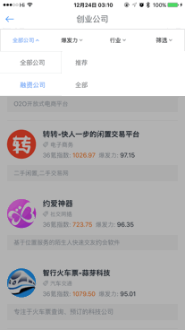

# 说明

这是一个用面向对象写的二级下拉菜单的示例. 上面的图使我们即将发布的4.0版本的截图, 它只是用来演示这个 demo 能达到什么效果, 代码中不包含这一块业务的实现!

我现在正计划写 iOS 开发的两个专题, 分别是关于36氪4.0版本的程序架构和用面向对象的方法做UI开发, 这个示例属于后者, 你可以在[这个网址](http://www.jianshu.com/users/61cd67a3e447/latest_articles)找到所有的文章, 很遗憾, 因为我们4.0的开发任务比较繁重,尽管我最近经常晚上写代码到凌晨, 但是还是 一直没有时间总结这些东西, 我是计划春节后将这两个专题的文章都完成, 算是在36氪工作半年来的一个总结. 希望回家后我的小侄子不会缠着我吧!

你可以随时关注上面的博客地址来获取最新的更新.

## 关于这个示例

示例的很多代码, 除了`DemoDropdownMenuManager`这个是自己编造的之外, 其它都是用在了我们的程序开发中的生产代码, 虽然都是自己的劳动成果, 但是所有权属于 36氪.

## 示例的局限性

1. 里面的`DropdownMenuConfiguration`文件比较杂乱, 没有办法, 按照我们 UI 的说法, 他们追求1像素的精度, 尽管我觉得 title 的字体应该一样, 但是说服不了他们, 为了方便调节面, 所以分的很细. 他们应该不会看到这句话!

2. `UIView+AutoLayout`的代码会需要重构, 其实它的作用和[SnapKit](https://github.com/SnapKit/SnapKit)挺类似, 但是我不喜欢它的前缀语法, 觉得 Swift 的 Extension 特性已经能写出更自然的语法, 但是我对自动布局的认识还不全面, 打算研究苹果的文档和 [SnapKit](https://github.com/SnapKit/SnapKit) 后自己写一个布局的 Library.

3. 这个界面只是整个工程很小的一部分, 其实上面的数据交互, 包括具体的 MenuManager的实现, 网络请求的管理, 缓存数据等是更复杂的交互逻辑, 这些东西我是打算放在以后关于架构的文章中介绍.这个 Menu 的作用只是提供一个可扩展的 Menu 界面, 也就是它并没有任何的逻辑在里面.

4. Menu 做的比较基础, 但是已经留出了很充足的接口进行扩展,我觉得你可以轻松的扩展, 比如想做出现的动画, 就可以在 `DropdownMenuViewController`的`animateHideSubmenu()`和`animateShowSubmenu()`中自己实现动画, 或者使用第三方的[pop](https://github.com/facebook/pop)或者其它动画库.
